# RedisLearning

# 一、Redis 概述

## 1. 简介

> 数据库排名：[DB-Engines Ranking - popularity ranking of database management systems](https://db-engines.com/en/ranking)
>
> 

Redis (Remote Dictionary Server)；一个开源的 key-value 存储系统；它支持的主要数据类型包括：

- String（字符串）
- list（链表）
- set（集合）
- zset（或称为sorted set，有序集合）
- hash（哈希类型）

> 1. 支持 push/pop 、add/remove，获取交集、并集、差集等一些相关操作，操作是原子性的。
> 2. redis 支持各种不同方式的排序；
> 3. redis （与 memcatched 相同）数据存在内存中；
> 4. redis 会周期性的把更新的数据写入磁盘，或者把修改的操作追加到记录文件；rdb / aof (持久化)
> 5. redis 支持集群，实现 master-slave(主从)同步操作；

## 2. 应用场景 ❤️

- 缓存: 配合关系型数据库做高速缓存；
- 计数器: 进行自增自减运算；
- 时效性数据: 利用 expire 过期，例如手机验证码功能；
- 海量数据统计: 利用位图，存储用户是否是会员、日活统计、文章已读统计、是否参加过某次活动；
- 会话缓存: 使用 redis 统一存储多台服务器用到的 session 信息；
- 分布式队列/阻塞队列:通过 list 双向链表实现读取和阻塞队列；
- 分布式锁: 使用 redis 自带 setnx 命令实现分布式锁；
- 热点数据存储: 最新文章、最新评论，可以使用 redis 的 list 存储，ltrim 取出热点数据，删除旧数据；
- 社交系统: 通过 Set 功能实现，交集、并集实现获取共同好友，差集实现好友推荐，文章推荐；
- 排行榜: 利用 sorted-set 的有序性，实现排行榜功能，取 top n；
- 延迟队列: 利用消费者和生产者模式实现延迟队列；
- 去重复数据: 利用Set集合，去除大量重复数据；
- 发布/订阅消息: pub/sub模式；

## 3. Redis 安装

(1) 下载地址：https://download.redis.io/releases/redis-6.2.6.tar.gz

> 在 linux 环境下安装，需要安装 gcc，因为 redis 是 C 语言编写的
>
>> 通过 `gcc -v` 命令，确定是否安装，`apt install gcc` 安装
>>

- 下载命令：`wget https://download.redis.io/releases/redis-6.2.6.tar.gz`
- 解压命令：`tar -zxvf redis-6.2.6.tar.gz`
- 编译 redis：`cd redis-6.2.6 && make`
- 安装 redis：`make install`

  > 默认安装位置：/usr/local/bin
  >

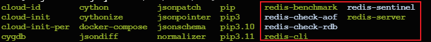

(2) 安装后文件概述

- redis-benchmark：性能测试工具
- redis-check-aof：修复 aof 持久化文件
- redis-check-rdb：修复 rdb 持久化文件
- redis-cli：redis 命令行工具
- redis-sentinel：redis 集群哨兵使用
- redis-server：启动 redis

## 4. Redis 启动和退出

> Redis 默认占用端口号 6379

#### 4.1 前台启动（不推荐）

使用命令 `redis-server` 调用 redis-server，启动后窗口不能操作

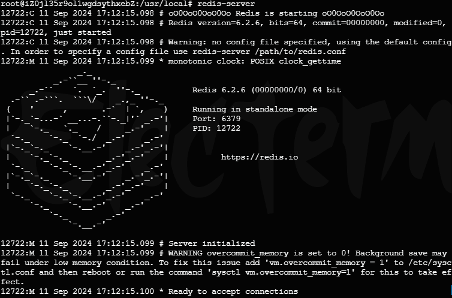

> 查看 redis 进程：`ps -ef | grep redis`

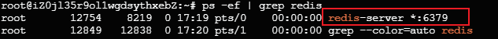

#### 4.2 后台启动（推荐）

(1) 进入 /redis-6.2.6 下，找到 redis.conf 文件，通过 `cp redis.conf redis_1.conf` 进行复制

(2) 修改配置文件：`vim redis_1.conf`

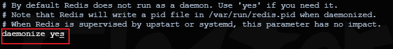

（3）后台启动：`redis-server redis_1.conf`

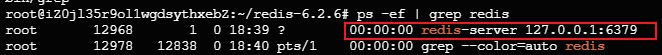

#### 4.3 启动命令行

> 先启动 redis-server 再启动命令行工具 redis-cli

- 使用命令：`redis-cli`

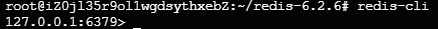

- 输入命令 `ping` 测试


#### 4.4 退出 redis

- 输入命令：`shutdown`，回车
- 再输入命令：`exit`

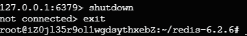

## 5. Redis 常用命令

> 进入到 redis-cli 命令行使用

- select：默认16个数据库，类似数组下标从 0 开始，初始默认使用 0 号库，使用 select 命令进行切换，语法：

  ```sql
  select <dbid>
  ```

  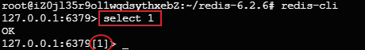
- 统一密码管理，所有库使用同样的密码；
- dbsize：查看当前数据库的 key 的数量；

  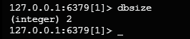
- set < key> < value>：存入键值对；

  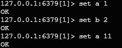
- get < key>：获取 key 对应的值；

  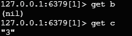
- flushdb：清空当前库；

  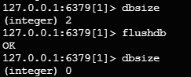
- flushall：清空全部库；
- keys *：查看当前库的所有 key；

  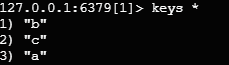
- exists < key>：判断某个 key 是否存在；

  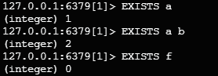
- type < key>：查看 key 的类型；

  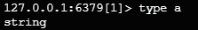
- object encoding < key>：查看底层的数据类型；

  
- del < key>：删除掉指定 key 数据；

  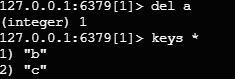
- unlink < key>：根据选择非阻塞删除，仅将 key 从 keyspace 元数据中删除，真正的删除会在后续中做异步操作；（效率）
- expire < key> secods：给 key 设置过期时间，以秒为单位；

  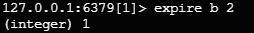
- ttl < key>：查看 key 还有多少秒过期；

  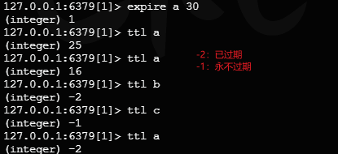

# 二、Redis 常用的五种数据类型

## 1. String 字符串

### （1）简介

> - String 类型在 redis 中最常见的一种类型;
> - String 类型是二进制安全的，可以存放字符串、数值、json、图像数据；“二进制安全”指的是以下几点：
>   - 任意数据存储：String 类型可以存储任何形式的二进制数据，由于Redis内部将字符串视为一个字节数组，因此它可以处理任何字节序列；
>   - 不解释数据：Redis 不会尝试去解析存储在 String 中的数据
>   - 传输安全：在Redis服务器和客户端之间传输数据时，数据不会被修改或解释，从而保证了数据的完整性
> - value 存储最大数据量是 512M

### （2）常用命令

- set < key> < value>：添加键值对，其中：
  - nx 参数：是当数据库中 key 不存在时，可以将 key-value 添加到数据库；
    - 在实现分布式锁时，可以使用 nx 参数来确保锁只能由一个客户端获取
  - xx 参数: 当数据库 key 存在时，可以将 key-value 添加到数据；
    - nx 与 xx 互斥；
  - ex 参数：设置 key-value 添加到数据库，并设置 key 的超时时间(以秒钟为单位)；
  - px 参数：设置 key-value 添加到数据库，并设置 key 的超时时间(以毫秒为单位)；
    - ex 与 px 互斥；


- get < key>：查询对应的键值；
- append < key> < value>：将给定的值追加到 key 的末尾；

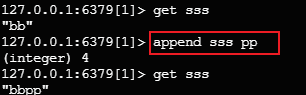

- strlen < key>：获取值的长度；
- setnx < key> < value>：添加键值对，当数据库中 key 不存在时，可以将 key-value 添加到数据库；
- setex < key> < timeout>< value>：添加键值对，同时设置过期时间(以秒为单位)；
- incr < key>：将 key 中存储的数字加 1 处理，只能对数字值操作；
- decr < key>：将 key 中存储的数字减 1 处理，只能对数字值操作；
- incrby < key> < increment>：将key中存储的数字值增加指定步长的数值, 如果是空，值为步长。(具有原子性);
- decrby < key> < increment>：将key中存储的数字值减少指定步长的数值, 如果是空，值为步长。(具有原子性);
- mset < key1>< value1> [< key2>< value2>...]：同时设置1个或多个 key-value 值；
- mget < key1>< value1> [< key2>< value2>...]：同时获取1个或多个 value；
- msetnx < key1>< value1> [< key2>< value2>...]：当所有给定的 key 都不存在时，同时设置1个或多个 key-value 值(具有原子性)；
- getrange/substr < key>< start>< end>：将给定 key，获取从 start (包含)到 end (包含)的值；
- setrange < key>< offset>< value>：从偏移量 offset 开始，用 value 去覆盖 key 中存储的字符串值；
- getset < key>< value>：对给定的 key 设置新值，同时返回旧值，如果 key 不存在，则添加一个 key-value 值；

### （3）应用场景 ⭐️

1. 单值缓存处理

   > set key value / get key
   >
2. 对象缓存

   > - set stu:001 value(json)
   > - mset stu:001:name zhangsan stu:001:age 18 stu:001:gender 男
   >
3. 分布式锁

   > - setnx key:001 true // 返回 1 代表加锁成功
   > - setnx key:001 true // 返回 0 代表加锁失败
   > - //..业务操作
   > - del key:001 // 执行完业务释放锁
   > - set key:001 true ex 20 nx // 防止程序意外终止导致死锁
   >
4. 计数器

   > - incr article:read:1001 // 统计文章阅读数量
   >
5. 分布式系统全局序列号

   > - incrby orderid 100 //批是生成序列号
   >

## 2. List 列表

### （1）简介

- Redis 列表是简单的字符串列表，单键多值；
- 按照插入顺序排序。可以添加一元素到列表的头部(左边)或者尾部(右边)；
- 一个列表最多可以包含 $2^{32}-1$ 个元素；
- 底层是一个**双向链表**：❤️
  - 对两端的操作性能很高；
  - 通过索引下标的操作中间的节点性能会较差；

### （2）常用命令

- lpush < key> < value1> [< value2> < value3>...]：从左侧插入一个或多个值；
- lpushx < key> < value1> [< value2> < value3>...]：将一个或多个值插入到已存在的列表头部;
- lrange < key> < start> < stop>：获取列表指走范围内的元素，0左边第1位，-1右边第1位，0~-1取出所有；
- rpush < key> < value1> [< value2> < value3>...]：从右侧插入一个或多个值；
- rpushx < key> < value1> [< value2> < value3>...]：将一个或多个值插入到已存在的列表尾部;
- lpop < key> [count]：移除并获取列表中左边第1个元素，count 表明获取的总数量，返回的为移除的元素；
- rpop < key> [count]：移除并获取列表中右边第1个元素，count 表明获取的总数量，返回的为移除的元素；
- rpoplpush < source>< destination>：移除源列表的尾部的元素(右边第一个)，将该元素添加到目标列表的头部(左边第一个)，并返回；
- lindex < key> < index>：通过索引获取列表中的元素；
- llen < key>：获取列表长度；
- linsert < key> before|after < pivot>< element>: 在 < pivot>基准元素前或者后面插入<element>
  - 如果 < key> 不存在，返回 0；
  - 如果 < pivot> 不存在，返回-1；
  - 如果操作成功，返回执行后的列表长度；
- lrem < key> < count> < element>：根据< count>的值，移除列表中与参数< element>相等的元素
  - count=0 移除表中所有与参数相等的值；
  - count>0 从表头开始向表尾搜索，移除与参数相等的元素，数量为 count；
  - count<0 从表尾开始向表头搜索，移除与参数相等的元素，数量为 count 的绝对值；
- lset < key> < index> < element>：设置给定素引位置的值；
- ltrim < key> < start> < stop>：对列表进行修剪，只保留给定区间的元素，不在指定区间的被删除；

### （3）应用场景 ❤️


++++++++++++++++++
