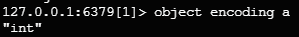

# RedisLearning

# 一、Redis 概述

## 1. 简介

> 数据库排名：[DB-Engines Ranking - popularity ranking of database management systems](https://db-engines.com/en/ranking)
>
> 

Redis (Remote Dictionary Server)；一个开源的 key-value 存储系统；它支持的主要数据类型包括：

- String（字符串）
- list（链表）
- set（集合）
- zset（或称为sorted set，有序集合）
- hash（哈希类型）

> 1. 支持 push/pop 、add/remove，获取交集、并集、差集等一些相关操作，操作是原子性的。
> 2. redis 支持各种不同方式的排序；
> 3. redis （与 memcatched 相同）数据存在内存中；
> 4. redis 会周期性的把更新的数据写入磁盘，或者把修改的操作追加到记录文件；rdb / aof (持久化)
> 5. redis 支持集群，实现 master-slave(主从)同步操作；

## 2. 应用场景 ❤️

- 缓存: 配合关系型数据库做高速缓存；
- 计数器: 进行自增自减运算；
- 时效性数据: 利用 expire 过期，例如手机验证码功能；
- 海量数据统计: 利用位图，存储用户是否是会员、日活统计、文章已读统计、是否参加过某次活动；
- 会话缓存: 使用 redis 统一存储多台服务器用到的 session 信息；
- 分布式队列/阻塞队列:通过 list 双向链表实现读取和阻塞队列；
- 分布式锁: 使用 redis 自带 setnx 命令实现分布式锁；
- 热点数据存储: 最新文章、最新评论，可以使用 redis 的 list 存储，ltrim 取出热点数据，删除旧数据；
- 社交系统: 通过 Set 功能实现，交集、并集实现获取共同好友，差集实现好友推荐，文章推荐；
- 排行榜: 利用 sorted-set 的有序性，实现排行榜功能，取 top n；
- 延迟队列: 利用消费者和生产者模式实现延迟队列；
- 去重复数据: 利用Set集合，去除大量重复数据；
- 发布/订阅消息: pub/sub模式；

## 3. Redis 安装

(1) 下载地址：https://download.redis.io/releases/redis-6.2.6.tar.gz

> 在 linux 环境下安装，需要安装 gcc，因为 redis 是 C 语言编写的
>
>> 通过 `gcc -v` 命令，确定是否安装，`apt install gcc` 安装
>>

- 下载命令：`wget https://download.redis.io/releases/redis-6.2.6.tar.gz`
- 解压命令：`tar -zxvf redis-6.2.6.tar.gz`
- 编译 redis：`cd redis-6.2.6 && make`
- 安装 redis：`make install`

  > 默认安装位置：/usr/local/bin
  >


(2) 安装后文件概述

- redis-benchmark：性能测试工具
- redis-check-aof：修复 aof 持久化文件
- redis-check-rdb：修复 rdb 持久化文件
- redis-cli：redis 命令行工具
- redis-sentinel：redis 集群哨兵使用
- redis-server：启动 redis

## 4. Redis 启动和退出

> Redis 默认占用端口号 6379

#### 4.1 前台启动（不推荐）

使用命令 `redis-server` 调用 redis-server，启动后窗口不能操作


> 查看 redis 进程：`ps -ef | grep redis`


#### 4.2 后台启动（推荐）

(1) 进入 /redis-6.2.6 下，找到 redis.conf 文件，通过 `cp redis.conf redis_1.conf` 进行复制

(2) 修改配置文件：`vim redis_1.conf`


（3）后台启动：`redis-server redis_1.conf`


#### 4.3 启动命令行

> 先启动 redis-server 再启动命令行工具 redis-cli

- 使用命令：`redis-cli`


- 输入命令 `ping` 测试


#### 4.4 退出 redis

- 输入命令：`shutdown`，回车
- 再输入命令：`exit`


## 5. Redis 常用命令

> 进入到 redis-cli 命令行使用

- select：默认16个数据库，类似数组下标从 0 开始，初始默认使用 0 号库，使用 select 命令进行切换，语法：

  ```sql
  select <dbid>
  ```

  
- 统一密码管理，所有库使用同样的密码；
- dbsize：查看当前数据库的 key 的数量；

  
- set < key> < value>：存入键值对；

  
- get < key>：获取 key 对应的值；

  
- flushdb：清空当前库；

  
- flushall：清空全部库；
- keys *：查看当前库的所有 key；

  
- exists < key>：判断某个 key 是否存在；

  
- type < key>：查看 key 的类型；

  
- object encoding < key>：查看底层的数据类型；

  
- del < key>：删除掉指定 key 数据；

  
- unlink < key>：根据选择非阻塞删除，仅将 key 从 keyspace 元数据中删除，真正的删除会在后续中做异步操作；（效率）
- expire < key> secods：给 key 设置过期时间，以秒为单位；

  
- ttl < key>：查看 key 还有多少秒过期；

  

# 二、Redis 常用的五种数据类型

## 1. String 字符串

### （1）简介

> - String 类型在 redis 中最常见的一种类型;
> - String 类型是二进制安全的，可以存放字符串、数值、json、图像数据；“二进制安全”指的是以下几点：
>   - 任意数据存储：String 类型可以存储任何形式的二进制数据，由于Redis内部将字符串视为一个字节数组，因此它可以处理任何字节序列；
>   - 不解释数据：Redis 不会尝试去解析存储在 String 中的数据
>   - 传输安全：在Redis服务器和客户端之间传输数据时，数据不会被修改或解释，从而保证了数据的完整性
> - value 存储最大数据量是 512M

### （2）常用命令

- set < key> < value>：添加键值对，其中：
  - nx 参数：是当数据库中 key 不存在时，可以将 key-value 添加到数据库；
    - 在实现分布式锁时，可以使用 nx 参数来确保锁只能由一个客户端获取
  - xx 参数: 当数据库 key 存在时，可以将 key-value 添加到数据；
    - nx 与 xx 互斥；
  - ex 参数：设置 key-value 添加到数据库，并设置 key 的超时时间(以秒钟为单位)；
  - px 参数：设置 key-value 添加到数据库，并设置 key 的超时时间(以毫秒为单位)；
    - ex 与 px 互斥；


- get < key>：查询对应的键值；
- append < key> < value>：将给定的值追加到 key 的末尾；


- strlen < key>：获取值的长度；
- setnx < key> < value>：添加键值对，当数据库中 key 不存在时，可以将 key-value 添加到数据库；
- setex < key> < timeout>< value>：添加键值对，同时设置过期时间(以秒为单位)；
- incr < key>：将 key 中存储的数字加 1 处理，只能对数字值操作；
- decr < key>：将 key 中存储的数字减 1 处理，只能对数字值操作；
- incrby < key> < increment>：将key中存储的数字值增加指定步长的数值, 如果是空，值为步长。(具有原子性);
- decrby < key> < increment>：将key中存储的数字值减少指定步长的数值, 如果是空，值为步长。(具有原子性);
- mset < key1>< value1> [< key2>< value2>...]：同时设置1个或多个 key-value 值；
- mget < key1>< value1> [< key2>< value2>...]：同时获取1个或多个 value；
- msetnx < key1>< value1> [< key2>< value2>...]：当所有给定的 key 都不存在时，同时设置1个或多个 key-value 值(具有原子性)；
- getrange/substr < key>< start>< end>：将给定 key，获取从 start (包含)到 end (包含)的值；
- setrange < key>< offset>< value>：从偏移量 offset 开始，用 value 去覆盖 key 中存储的字符串值；
- getset < key>< value>：对给定的 key 设置新值，同时返回旧值，如果 key 不存在，则添加一个 key-value 值；

### （3）应用场景 ⭐️

1. 单值缓存处理

   > set key value / get key
   >
2. 对象缓存

   > - set stu:001 value(json)
   > - mset stu:001:name zhangsan stu:001:age 18 stu:001:gender 男
   >
3. 分布式锁

   > - setnx key:001 true // 返回 1 代表加锁成功
   > - setnx key:001 true // 返回 0 代表加锁失败
   > - //..业务操作
   > - del key:001 // 执行完业务释放锁
   > - set key:001 true ex 20 nx // 防止程序意外终止导致死锁
   >
4. 计数器

   > - incr article:read:1001 // 统计文章阅读数量
   >
5. 分布式系统全局序列号

   > - incrby orderid 100 //批是生成序列号
   >

## 2. List 列表

### （1）简介

- Redis 列表是简单的字符串列表，单键多值；
- 按照插入顺序排序。可以添加一元素到列表的头部(左边)或者尾部(右边)；
- 一个列表最多可以包含 $2^{32}-1$ 个元素；
- 底层是一个**双向链表**：❤️
  - 对两端的操作性能很高；
  - 通过索引下标的操作中间的节点性能会较差；

### （2）常用命令

- lpush < key> < value1> [< value2> < value3>...]：从左侧插入一个或多个值；
- lpushx < key> < value1> [< value2> < value3>...]：将一个或多个值插入到已存在的列表头部;
- lrange < key> < start> < stop>：获取列表指走范围内的元素，0左边第1位，-1右边第1位，0~-1取出所有；
- rpush < key> < value1> [< value2> < value3>...]：从右侧插入一个或多个值；
- rpushx < key> < value1> [< value2> < value3>...]：将一个或多个值插入到已存在的列表尾部;
- lpop < key> [count]：移除并获取列表中左边第1个元素，count 表明获取的总数量，返回的为移除的元素；
- rpop < key> [count]：移除并获取列表中右边第1个元素，count 表明获取的总数量，返回的为移除的元素；
- rpoplpush < source>< destination>：移除源列表的尾部的元素(右边第一个)，将该元素添加到目标列表的头部(左边第一个)，并返回；
- lindex < key> < index>：通过索引获取列表中的元素；
- llen < key>：获取列表长度；
- linsert < key> before|after < pivot>< element>: 在 < pivot>基准元素前或者后面插入<element>
  - 如果 < key> 不存在，返回 0；
  - 如果 < pivot> 不存在，返回-1；
  - 如果操作成功，返回执行后的列表长度；
- lrem < key> < count> < element>：根据< count>的值，移除列表中与参数< element>相等的元素
  - count=0 移除表中所有与参数相等的值；
  - count>0 从表头开始向表尾搜索，移除与参数相等的元素，数量为 count；
  - count<0 从表尾开始向表头搜索，移除与参数相等的元素，数量为 count 的绝对值；
- lset < key> < index> < element>：设置给定素引位置的值；
- ltrim < key> < start> < stop>：对列表进行修剪，只保留给定区间的元素，不在指定区间的被删除；（包含端点）
- brpop < key> < timeout>：阻塞式移除指定 key 的元素，如果 key 中没有元素，就等待，直到有元素或超时，执行结束；

### （3）应用场景 ❤️

1. 数据队列

   > - 堆栈：stack = lpush + lpop
   > - 队列：queue = lpush + rpop
   > - 阻塞式消息队列：block_mq = lpush + brpop
   >
2. 订阅号时间线

   > lrange key start stop
   >

## 3. Hash 哈希

### （1）简介

是一个 string 类型的键和 value(对象)，特别适合于存储对象，类似于 java 里面学习的 Map <String, Object>；

> 假设场景: 需要在 redis 中存储学生对象，对象属性包括(id,name,gender,age)，有以下几种处理方式：
>
> - 方式一: 用 key 存储学生id，用 value 存储序列化之后用户对象 (如果用户属性数据需要修改，操作较复杂，开销较大)；
> - 方式二: 用 key 存储学生 id:属性名，用 value 存储属性值 (用户 id 数据冗余)；stu001:id 001 / stu001:name zhangsan；
> - 方式三: 用 key 存储学生 id，用 value 存储 field + value 的 hash；:star: 通过 key(学生id) + field(属性) 可以操作对应数据；


### （2）常用命令

- hset < key> < field> < value>[< field> < value>...]：用于为哈希表中的字段赋值，如果字段在 hash 表中存在，则会被覆盖；


- hget < key> < field>：返回哈希表中指定的字段的值；
- hmget < key> < field> [< field> < field>...]：获取哈希表中所有给定的字段值；


- hgetall < key>: 获取在哈希表中指定 key 的所有字段和值；


- hsetnx < key> < field> < value>：只有在字段不存在时，才设置哈希表字段中的值；
- hmset: 用法同 hset，在 redis4.0 中被弃用；
- hexists < key> < field>：判断哈希表中指定的字段是否存在，存在返回1，否则返回0；
- hkeys < key>：获取哈希表中所有的字段；
- hvals < key>：获取哈希表中所有的值；
- hlen < key>: 获取哈希表中的 field 数量；
- hdel < key> < field> [< field>...]：删除一个或多个哈希表字段；
- hincrby < key> < fied>< increment>：为哈希表 key 中指定的 field 字段的整数值加上增加 increment（整数值,可以是负数）；
- hincrbyfloat < key>< field> < increment>：为哈希表 key 中指定的 field 字段的**浮点数**值加上增加 increment（浮点数,可以是负数）；

### （3）应用场景

1. 对象缓存：hset stu:001 name zhangsan age 20 gender man；
2. 电商购物车操作：

   > 以用户 id 作为 key，以商品 id 作为 field，以商品数量作为 value
   >
   > - 添加商品:
   >   - hset user:001 s:001 1
   >   - hset user:001 s:002 2
   > - 增减商品数量: hincrby user:001 s:001 3
   > - 查看购物车商品总数: hlen user:001
   > - 删除商品: hdel user:001 s:001
   > - 获取所有商品: hgetall user:001
   >

## 4. Set 集合

set 是 string 类型元素无序集合，对外提供的功能和 list 类似，是一个列表功能；集合成员是唯一的；

### （1）常用命令

- sadd < key> < member> [< member>..]：将一个或多个成员元素加入到集合中，如果集合中已经包含成员元素，则被忽略；
- smembers < key>：返回集合中的所有成员；


- sismember < key> < member>：判断给定的成员元素是否在集合中存在，如果存在返回 1，否则返回 0；
- scard < key>: 返回集合中元素个数；
- srem < key>< member>[< member>...]：移除集合中一个或多个元素；
- spop < key> [< count>]：移除并返回集合中的一个或 count 个随机元素；
- srandmember < key> [< count>]：与 spop 相似，返回随机元素，不做移除；
- smove < source> < destination> < member>：将 member 元素从 source 源移动到 destinatlon 目标；
- sinter < key> [< key>...]：返回给定集合的交集(共同包含)元素；


- sinterstore < destination> < key1> [< key2>...]：返回给定所有集合的交集，并存储到 destination 目标中；


- sunion < key> [< key>...]：返回给定集合的并集(所有)元素；
- sunionstore < destination> < key1> [< key2>...]：返回给定所有集合的并集，并存储到 destination 目标中；
- sdiff < key> [< key>...]：返回给定集合的差集(key1中不包含在key2中的元素)；
- sdiffstore < destination><key1>[< key2>...]：返回给定所有集合的差集，并存储到 destination 目标中；

### （2）应用场景

1. 抽奖

   > - 参与抽奖: sadd cj001 user:13000000000 user:13455556666 user:13566667777
   > - 查看所有参与用户: smembers cj001
   > - 实现抽奖：spop cj0013 / srandmember cj001 3
   >
2. 朋友圈点赞

   > - 点赞
   >   - sadd like:friend001 user:001
   >   - sadd like:friend001 user:002
   > - 取消点赞 srem like:friend001 user:001
   > - 判断用户是否已点赞 sismember like:friend001 user:001
   > - 显示点赞用户 smembers like:friend001
   > - 获取点赞次数 scard like:friend001
   >
3. 关注模型：sinter 交集 sunion 并集 sdiff 差集

   > - 微博 sadd g:list:u001 1001 sadd g:list:u002 1001 你们共同关注的 sinter交集
   > - QQ 你们有共同好友 sinter交集
   > - 快手 可能认识的人 sdiff差集
   >

## 5. ZSet 有序集合

### （1）简介

- 有序集合是 string 类型元素的集合，不允许重复出现成员；
- 每个元素会关联一个 double 类型的分数，redis 是通过分数为集合中的成员进行从小到大的排序；
- 有序集合的成员是唯一的，但是分数可以重复；
- 成员因为有序，可以根据分数或者次序来快速获取一个范围内的元素；

### （2）常用命令

- zadd < key> < score> < member>[< score>< member>...]：将一个或多个元素及其分数加入到有序集合中；
- zrange < key>< min>< max> [byscore | bylex] [rev] [ limit offset count] [withscores]：返回有序集合指定区间的成员，(byscore 按分数区间，bylex 按字典区间，rev 反向排序(分数大的写前边，小的写后边)，limit分页(offset 偏移量，count返回的总数)，withscores 返回时带有对应的分数)；
- zrevrange < key> < start> < stop> [ limit offset count]：返回集合反转后的成员
- zrangebyscore < key> < min> < max> [withscores] [ limit offset count]：参考 zrange 用法；
- zrevrangebyscore < key>< max>< min> [withscores] [limit offset count]：参考zrange用法
- zrangebylex < key> < min> < max> [limit offset count：通过字典区间返回有序集合的成员；
  - zrangebylex k2 - + ：减号最小值，加号最大值；
  - zrangebylex k2 [aa (ac：[ 中括号表示包含给定值，( 小括号表示不包含给定值；


- zcard < key>：获取集合中的成员数量；
- zincrby < key> < increment> < member>：为集合中指定成员分数加上增量 icrement；
- zrem < key> < member> [< member>...]：移除集合的一个或多个成员；
- zcount < key> < min> < max>：统计集合中指定区间分数(都包含)的成员数量；
- zrank < key> < member>：获取集合中成员的索引位置；
- zscore < key> < member>：获取集合中成员的分数值；

### （3）应用场景

1. 按时间先后顺序排序: 朋友圈点赞 zadd 1656667779666
2. 热搜 微博 今日头条 快手
3. 获取 topN zrevrange k1 300 10 limit 0 10

# 三、Redis 持久化

- 目前，redis 的持久化主要应用 AOF(Append Only File) 和 RDB (Redis Database Backup) 两大机制；
- AOF 以日志的形式来记录每个写操作 (增量保存)，将 redis 执行过的所有（正确的）写指令全部记录下来 (读操作不记录)；
- 只许追加文件，但不可以改写文件；
- redis 启动之初会读取该文件，进行重新构建数据；

## 1. AOF

### （1）开启 aof

- AOF 默认不开启，在 conf 配置文件中进行配置；


- 重新启动


> - 默认文件名是 appendonly.aof；
> - 默认是启动后的相对路径，redis 在哪里启动，appendonly.ao f文件就在哪生成；

### （2）AOF 日志是如何实现的

#### a. 为什么使用 AOF 日志？

1️⃣ **WAL**：数据库写前日志 (Write Ahead Log)，在实际写数据库前，先把修改的数据记录到日志文件中，以便发生故障时，及时恢复；

2️⃣ **AOF**：数据库写后日志，redis 先去执行命令，把数据写入内存中，然后才去记录日志；


> ⭐️ .aof 文件中的保存内容
>
> 

> ❤️ redis 为什么使用写后日志AOF？
>
> 1. 避免检查开销：向AOF中记录日志，是不做检查的,如果写前执行，很有可能将错误指令记录到日志中，在使用 redis 恢复日志时，就可能会出现错误;
>    > 先执行后记录，只有执行成功的指令才会被记录，以免在恢复数据的时候引入错误指令；（错误指令不会被记录，读取操作不被记录）
>    >
> 2. 不会阻塞当前的写操作

#### b. AOF 日志有什么风险？:heart:


1. .aof 文件可能由于异常原因被损坏，可以使用 redis 自带的命令 `redis-check-aof --fix appendonly.aof` 文件，修复成功则可以正确启动；
2. 由于刚刚执行一个指令，还没有写入日志，就宕机了。就会导致数据永久丢失 (redis 做为数据库存储的情况下)；
3. AOF 避免了对当前指令的阻塞，但可能会由于磁盘写入压力较大，对下一个操作带来阻塞风险；

### （3）AOF 日志三种写回策略

配置 conf 文件：


1. aways：同步写回，每个写指令执行完，立即同步将指令写入磁盘日志文件中；
2. everysec：每秒写回，默认配置方式。每个写指令执行完，先把日志写到AOF文件的内存缓冲区，每隔一秒把缓冲区的内容写入磁盘；
3. no：操作系统控制写回，每个写指令执行完，先把日志写到 AOF 文件的内存缓冲区，由操作系统决定何时把缓区的内容写入磁盘；


### （4）AOF 日志重写机制

> - 由于服务器资源有限，appendonly.aof 的文件大小随着使用不断增加，需要对其进行重写，降低资源占用；
> - 根据 appendonly.aof，将数据重新写入内存，出现类似于进栈/出栈的操作，需要重写 .aof 文件，只要写入最后结果的命令

Redis 根据数据库现有数据，创建一个新的 AOF 文件，读取数据库中所有键值对，重新对应一条命令写入。可以使用命令 `bgreWriteaof`，（ 在 redis-cli 环境执行）

#### a. AOF 重写相关配置

配置 conf 文件：


> 例如 文件 80m，开如重写，重写后降到 50m，下一次，达到 100m 再开始重写；

#### b. AOF 重写流程

- bgrewirteaof 触发重写，判断是否当前有重写在运行，如果有，则等待重写结束后再执行；
- 主进程 fork 出一个子进程，执行重写操作，保证主进程不阻塞，可以继续执行命令；
- 子进程循环遍历 reids 内存中的所有数据到临时文件，客户端的写请求同时写入 aof 缓冲区和 aof 重写缓冲区保证原 AOF 文件完整以及新的 AOF 文件生成期间的新的数据修改操作不会丢失；
- 子进程写完新 AOF 文件以后，向主进程发送信号，主进程更新统计信息；
- 主进程把 aof 重写缓冲区中的数据写入到新的 AOF 文件用新 AOF 文件覆盖掉旧的 AOF 文件，完成 AOF 重写；


## 2. RDB

由于 Redis 是单线程的，所以要避免使得主线程阻塞的操作；

> - RDB：（Redis DataBase）内存快照，记录内存中某一时刻数据的状态；
> - RDB 和 AOF 相比，RDB记录的是数据，不是操作指令；
> - redis 提供了两个命令生成 RDB 文件：
>   - save: 在主线程中执行，会导致阻塞；
>   - bgsave: 创建一个子进程，专门用来写 RDB，避免主线程阻塞，默认配置；

- 使用 RDB


### （1）写时复制技术

> 例: 6GB内存数据量，磁盘的写入 0.3GB/S，需要 20S 时间，来完成 RDB 文件的写入?
>
> 处理技术：写时复制技术 (copy-on-write cow)，在执行快照处理时，仍然正确执行写入操作；


### （2）快照频率

配置 conf 文件，修改快照频率；


- 全量快照 & 增量快照
- 混合使用 AOF & RDB

### （3）混合应用 AOF & RDB

1. 通过 redis.conf 配置文件；
2. 打开 aof；
3. 打开混合配置；（默认是打开的）


🔴 混合的过程


> - 在 aof 文件中，前半部分，就是 rdb 文件的内容，从 bgrewirteaof 之后，是 aof 文件内容；
> - 重写就是把 RDB 的内容放到 AOF 中；

## 3. 关于对 redis 执久化处理的建议

- 【    /    】 如果数据在服务器运行的时候，使用 redis 做缓冲，可以不使用任何持久化方式；
- 【rdb & aof】 数据不能丢失，rdb 和 aof 混合使用是一个好的选择；
- 【   rdb   】 如果数据不要求非常严格，可以允许分钟级别丢失，可以使用 rdb；
- 【   aof   】 如果只使用 AOF，建议配置策略是 everysec，在可靠性和性能之间做了一个折中；
- 如果磁盘允许，尽量避免 AOF 重写的频率；

对比：:heart:

> AOF:
>
> - 数据不易丢失：AOF 可以记录所有的写操作，即使 Redis 崩溃，也可以通过重放 AOF 文件来恢复数据，理论上数据丢失的可能性很小；
> - 恢复速度慢: AOF 文件记录了所有的写操作，因此文件体积通常较大，这可能导致读取速度变慢和占用更多的磁盘空间 I/O；
>
> RDB:
>
> - 数据安全性低：如果 Redis 在两次快照之间崩溃，那么这段时间内的数据将会丢失；
> - 恢复速度快：DB 文件通常较小，当 Redis 重启时，加载 RDB 文件恢复数据的速度较快；相较于 AOF 文件，通常体积更小；不太占用磁盘 I/O；

# 四、Redis 集群方案

> - AOF & RDB 持久化方案解决了数据安全问题，保证数据尽可能地在服务器意外宕机时少丢失，最大程度恢复数据；
> - 但是在服务器宕机到恢复的这段时间，新来的请求如何处理？也就是如何保证服务器少服务少中断，提高服务的可用性；
> - redis 提高可用性的方式，增加副本（集群方案）；


## 1. 主从复制

### （1）读写分离

1️⃣ 主从库之间采用读写分离的方式：

> - 读操作: 主库、从库都可以处理；
> - 写操作: 首先写到主库执行，然后再将主库同步给从库；

🔴 读写分离的作用：

- 实现读写分离，性能扩展；
- 容灾快速恢复；


### （2）主从复制使用

> 配置一主二从，如下所示：


🔴 步骤: 分别创建三个 redis 实例；

1. 以默认配置文件 redis.conf 作为基本通用配置（需要打开后台运行），配置三个 不同的 conf 文件；


```ini
# include 命令用于在当前文件中包含其它文件内容
include redis-base.conf
# pidfile 命令用于指定 Redis 进程 ID (PID) 文件的路径
pidfile /var/run/redis_6379.pid
# port 命令用于设置Redis 服务器监听的端口号
port 6379
# dbfilename 命令 指定了数据持久化文件的名字
dbfilename dump6379.rdb
```

> 上述补充指令在 redis-base.conf 配置文件中都存在，新增的覆盖掉原来的配置；

3. 打开三个窗口，以三个配置文件，分别启动 redis-server；
4. redis-cli 命令行工具连接到不同端口；

> info replication：查看主从状态


4. 从节点连接到主节点

> replicaof host port


### （3）宕机演示

> 主节点可以读写，从节点只能读；


1. 从服务器宕机

- 6381 上调用 shutdown；
- 在主服务器上写入数据；
- 6381 重新连上时，仍然可以接收到主服务器的数据；


2. 主服务器宕机

- 6379 服务器调用 shutdown；
- 在从服务器上仍然可以读取数据；
- 从服务器显示主服务器的状态为 down；
- 当主服务器重新启动，从服务器显示主服务器的状态是 up；


### （4）主从同步原理 ❤️


1️⃣ 第一阶段，主从建立连接，协商同步。

- 从库和主库建立连接，告诉主库即将进行同步操作。主库需要确认并回复主从就可以开始进行同步处理了。
- 从库向主库发送一个 psync 指令，包含两个参数：
  - 一个是主库的 runID：runID 是每个 redis 实例启动时生成的一个随机ID，唯一标识；
  - 另一个是复制进度 offset：
- 第一次复制时，从库不知道主库的 runid，所以设为 ？，offset 设置为 -1 表示第一次复制；
- 主库收到指令后，会发送给从库 fullresync 指令去响应，带着主库的 runid，还有目前复制进度 offset；
  - fullresync 表示全量复制，主库把所有内容都复制给从库；
- 从库会记录下这两个参数。

2️⃣ 第二阶段，主库将所有数据发送给从库进行同步。

- 从库收到 rdb 文件后，在本地把原有的数据清除，同步从主库接收到的 rdb 文件；
- 如果在主库把数据跟从库同步的过程中，主库还有数据写入，为了保证主从数据的一致性，主库会在内存中给一块空间 replication buffer，专门记录 rdb 文件生成后收到的所有写操作。

3️⃣ 第三阶段，主库把第二阶段执行过程中新收到的操作 replication buffer，再发送给从库，从库再加载执行这些操作，就实现同步处理了。

### （5）主-从-从模式

> 如果有很多从节点。只有一个主节点时，主节点向从节点同步数据（rdb文件）的压力很大，所以需要采用 主-从-从 模式来分散主节点的压力；

采用 主-从-从 模式，将主库生成和传输 rdb 文件的压力，以级联方式分散到从库上。


> 主库同步给从库，从库再同步给从库的从库；

### （6）网络连接异常情况

> - 在 redis 2.8 之前，如果网络异常，再次连接后，需要做全量复制；
> - 从 redis 2.8 之后，采用增量复制方式
>   - 需要用到 repl_backlog_buffer 缓冲区；
>   - 主库把收到写操作，写入 repllcation buffer，同时，也写入到 repl_backlog_buffer 缓冲区；
>   - repl_backlog_buffer 缓冲区，主库会记录自己写到的位置，从库会记录自己读到的位置


> 增量同步：master_repl_offset 和 slave_repl_offset，各自记录  写/读 的位置，当从节点宕机后再上线，slave_repl_offset 只需要读取差值即可；
>
> 问题：当从节点宕机时间过久，master_repl_offset 写了一圈越过 slave_repl_offset，这时会丢失数据，所以要设置合适的 repl-backlog-size 缓冲区大小

⭐️ repl_backlog_buffer 缓冲区大小可以配置，默认 1M 大小；

> 缓冲空间大小 = 主库写入速度 * 操作大小 - 主从库网络传输速度 * 操作大小
>
> repl-backlog-size = 缓冲空间大小 * 2

## 2. 哨兵模式

> 主从复制模式，解决了从节点宕机后读数据的问题；但是并没有解决主节点宕机无法写数据的问题；（主节点读写，从节点只读）

哨兵模式：当主库宕机，在从库中选择一个，切换为主库。

问题：

> 1. 主库是否真正宕机?
> 2. 哪一个从库可以作为主库使用?
> 3. 如何实现将新的主库的信息通知给从库和客户端?

### （1）基本流程

> 哨兵主要任务：
>
> - 监控：周期性 ping 主/从节点
>   - 从库：当前 sentinel 节点指定时间内未收到从库应答，则认为主客观都下线；
>   - 主库：当前 sentinel 节点指定时间内未收到主库应答，则认为主库主观下线，当大部分 sentinel 节点都主观认为主库下线，则主库变为客观下线；此时需要重新选择主库；
> - 选择主库
>   - 筛选：筛掉一些宕机和网络差的节点；
>   - 打分：三轮打分选择分数最高，优先级、与主库同步程度、id值；
> - 通知

### （2）哨兵模式配置

1. 新建配置文件：`vim sentinel.conf`，编辑并保存如下内容：

```ini
# 配置哨兵端口
port 26379
# 配置监控的猪节点地址 1 表示只要有一个哨兵主观认为主节点下线，则主节点就客观下线
# sentinel monitor <自定义的reids主节点名称> <IP> <port> <数量>
sentinel monitor mymaster 127.0.0.1 6379 1
# 配置主观认为主节点下线的等待时间，单位 毫秒
sentinel down-after-milliseconds mymaster 30000
```

2. 启动三个 redis 实例，配置成一主二从模式；

   
3. 启动哨兵：`redis-sentinel sentinel.conf`


4. 将主节点宕机，观察哨兵监控信息变化；

> 将一个从库 6380，切换成主库，将 6381，切换成 6379 的从库；


5. 将主节点再次上线，观察哨兵监控信息变化；

> 原来主库 6379 再次启动，6379 切换成 6380 的从库；


#### ❤️ 主节点切换的实现方式：自动重写 redis 实例配置文件


### （3）选主流程 ❤️

> 筛选 + 打分机制，来实现新主库的选定

1. 筛选：筛选掉一些宕机的和网络不好的节点，剩下的节点作为备选进行打分；
2. 打分：三轮打分

- 第一轮：优先级
  - 通过 replica-priority 配置项，给不同的从库设置优先级，可以将内存大，网络好，配置高的从库优先级设置更高；
- 第二轮：和原主库同步程度；
  - 选择和原主库 repl_backlog_buffer （环形缓冲区）中的位置最接近的，做为分数最高；
- 第三轮：ID 号小的从库得分高，每一个 redis 实例都有一个id；


### （4）哨兵集群

> - 采用多个哨兵，组成一个集群，以少数服从多数的原则，来判断主库是否已客观下线：（防止单个哨兵产生较大误判概率）；
> - 多数一般指 n/2 + 1；（向下取整）
> - 如果集群中，有哨兵实例掉线，其他的哨兵还可以继续协作，来完成主从库监控和切换的工作；

#### a. 部署

模式：redis 实例一主二从，sentinel 实例三个节点集群；

1. 创建了一个目录 mysentinel；
2. 分别创建三个哨兵配置文件

> - sentinel26379.conf
> - sentinel26380.conf
> - sentinel26381.conf

配置如下：

> `sentinel down-after-milliseconds mymaster 30000`，每个哨兵等待时间要配置一致，否则达不成一致选库切换；:star:

```ini
port 26381
sentinel monitor mymaster 127.0.0.1 6379 2
```

```ini
port 26380
sentinel monitor mymaster 127.0.0.1 6379 2
```

```ini
port 26379
sentinel monitor mymaster 127.0.0.1 6379 2
```

3. 再次配置一主二从 reedis 实例；
4. 启动三个 redis 实例，配置成一主二从，6379是主库；
5. 依次启动三个哨兵实例，主库宕机，发现主库下线后，选举新的从库做为主库；


#### b. 运行机制

> - 基于 pub/sub，即 发布/订阅 机制实现哨兵集群组成；
> - 基于 info 命令实现哨兵监控从库；
> - 基于自身的 pub/sub，实现哨兵与客户端之间的通知（主库切换）；

##### 发布 / 订阅 ❤️

- 订阅：`subscrie channel [channel1...]`
- 发布：`publis channel <message>`

> 订阅一个或多个频道，一旦频道上有消息发布，订阅了这个频道的用户都可以收到信息；
>
> 


结构图：


## 3. 分片集群

> 业务场景，需要存储 50G 的数据，但是内存和硬盘配置不足时，选用两种方式解决：
>
> - 纵向扩展：加内存，加硬盘，提高CPU；
>   - 简单、直接；RDB存储效率要考虑，成本要考虑
> - 横向扩展：加实例；:star:

### （1）分片集群配置

配置成一主一从的三个分片：


1. 创建文件夹`mkdir mycluster`，在 /mycluster 目录下配置 6 个配置文件；
2. 从 /redis-6.2.6 目录下，将默认配置文件 redis.conf 复制到 /mycluster 目录下，并打开后台启动 `daemonize yes`；
3. 配置 6 个配置文件：

> redis6379.conf / redis6380.conf / redis6479.conf / redis6480.conf / redis6579.conf / redis6580.conf


> vim编辑器下，替换内容命令：`:%s/原内容/替换内容`
>
> ```ini
> :%s/6379/6380
> ```

```ini
include redis-base.conf
pidfile "/var/run/redis_6379.pid"
port 6379
dbfilename "dump6379.rdb"
# 打开集群配置 
cluster-enabled yes
# 设定节点配置文件
cluster-config-file nodes-6379.conf
# 设置节点失联时间
cluster-node-timeout 15000
```

4. 修改 redis-base.conf 配置文件，将 bind ip 地址加入（加入本机IP地址），172.20.255.51

> 这里不适用本地环回地址 127.0.0.1 是因为，本地环回地址的数据包不会离开本机，因此不能在网络中的其他节点间传递。本地环回地址的设计目的是为了本地测试和调试，而不是为了支持分布式系统或集群环境下的节点间通信。因此，在配置集群时，应该使用实际的网络接口地址，确保各个节点能够互相识别并建立有效的通信链路。:star:


5. 启动这 6 个 redis 实例，并保证启动成功；


6. 将 6 个 redis 实例合成一个集群；

```bash
redis-cli --cluster create <node1-ip>:<node1-port> <node2-ip>:<node2-port> ... <nodeN-ip>:<nodeN-port> --cluster-replicas <replicas-count>
```

```bash
   redis-cli --cluster create \
     172.20.255.51:6379 \
     172.20.255.51:6380 \
     172.20.255.51:6479 \
     172.20.255.51:6480 \
     172.20.255.51:6579 \
     172.20.255.51:6580 \
     --cluster-replicas 1
```

> 其中 `--cluster-replicas 1` 表示每个主节点拥有一个从节点


### （2）Hash Slot 哈希槽

在使用 redis cluster 方案中，一个分片集群有 16384 个哈希槽，哈希槽表示数据分区；

```bash
Master[0] -> Slots 0 - 5460
Master[1] -> Slots 5461 - 10922
Master[2] -> Slots 10923 - 16383
```

> - 划分方法：16384 / n；其中 n 是有 n 个分片；
> - 数据存在哪个分片上是通过键值对的 key 按照 CRC16 算法计算一个 16bit 的值；
> - 再用这个值对 16384 取模运算，得到的数代表对应编号的 hash slot；
> - hash16 % 16384 [0-16383]，落在上述哪个区间，就在哪个分片；

❤️【hash slot 分配方案】：

- cluster create 命令创建集群时，redis 会自动把这些 hash slot 平均分布在集群实例上。如果集群中有 N 个实例(主库)，每个实例上分配到的 hash slot 就是 16384/N；
- 使用 cluster addslos 手工分配哈希槽；

### （3）数据操作


++++++++++++++++++
